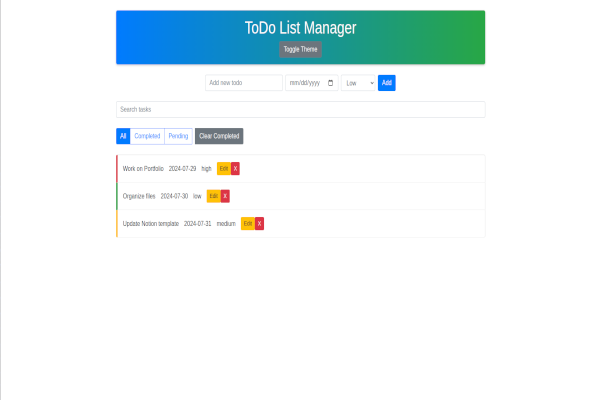

# ToDo List Manager


## Description
The ToDo List Manager is a feature-rich web application designed to help users efficiently manage their tasks. Users can add, edit, and delete tasks, set due dates, assign priority levels, filter tasks by status, and search for tasks. The application uses local storage to persist data across sessions and leverages Bootstrap for a modern and responsive design.

## Features
- Add new tasks.
- Edit tasks.
- Set due dates and priority levels.
- Mark tasks as completed or pending.
- Delete tasks.
- Search tasks.
- Filter tasks by status.
- Theme toggle (light/dark mode).
- Persistent data storage using local storage.

## Getting Started
### Prerequisites
- Web browser (e.g., Chrome, Firefox)

### Installation
1. Clone the repository and change directory:
   ```sh
   git clone https://github.com/Breedlove-Jason/toDoApp.git
   cd toDoApp
   ```

2. Open `index.html` in your web browser.
   
## Usage
   * Enter your task in the input field.
   * Select a due date and priority level.
   * Click the "Add" button to add the task to the list.
   * Click on a task to mark it as completed.
   * Click the "Edit" button next to a task to edit it.
   * Click the "X" button next to a task to delete it.
   * Use the search bar to find specific tasks.
   * Use the filter buttons to view all, completed, or pending tasks.
   * Click the "Toggle Theme" button to switch between light and dark modes.
   
## License
   This project is licensed under the MIT License.

### Acknowledgements:
Bootstrap